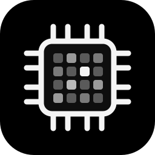

<p align="center">
  
</p>

# Blake2b ASIC Control on StartOS

> Everything not listed in this document should behave the same as upstream
> Blake2b ASIC Control. If a feature, setting, or behavior is not mentioned
> here, the upstream documentation is accurate and fully applicable — see the
> Documentation section of `instructions.md` for links.

[Blake2b ASIC Control](https://github.com/christhealien/blake2b-asic-control) is a local dashboard for Blake2b ASIC miners (SC Lite, SC Box, HS Box and others): a fleet view, one-click presets (clock, voltage and fan curve), a weekly schedule, Telegram and Discord alerts, best-share and rejected-share tracking, 24-hour hashrate graphs, a per-chip map, a read-only miner report for models it hasn't been tested on, and a per-chip auto-tuner for the SC Lite. It talks to the miners only through their own web API and port 4028.

- **Upstream repo:** <https://github.com/christhealien/blake2b-asic-control>
- **Wrapper repo:** <https://github.com/christhealien/blake2b-asic-control-startos>

---

## Table of Contents

- [Image and Container Runtime](#image-and-container-runtime)
- [Volume and Data Layout](#volume-and-data-layout)
- [File Models](#file-models)
- [Dependencies](#dependencies)
- [Network Access and Interfaces](#network-access-and-interfaces)
- [Installation and First-Run Flow](#installation-and-first-run-flow)
- [Actions](#actions)
- [Tasks](#tasks)
- [Health Checks](#health-checks)
- [Backups and Restore](#backups-and-restore)
- [Limitations and Differences](#limitations-and-differences)
- [Quick Reference for AI Consumers](#quick-reference-for-ai-consumers)

---

## Image and Container Runtime

One image, the same one the upstream Umbrel app runs, built by the upstream repo's GitHub Actions for both architectures.

| Property      | Value                                         |
| ------------- | --------------------------------------------- |
| Image         | `ghcr.io/christhealien/blake2b-asic-control`  |
| Architectures | x86_64, aarch64                               |
| Command       | `/app/entrypoint.sh` (the dashboard and its helper) |
| User          | `1000:1000` (the image's own user)            |

| Subcontainer | Purpose                                        |
| ------------ | ---------------------------------------------- |
| `app-sub`    | The `primary` daemon — the one to `attach` to  |

The entrypoint starts the dashboard (`server.py`, port 8787) and a small widget server that only the Umbrel app uses (not exposed here). On stop, it first stops any running tuning run so that run puts the miner back on its best tested setting; that can take up to 30 s, so the daemon's `sigtermTimeout` is 60 s.

Environment set by the package: `SCLITE_WEBUI_HOST=0.0.0.0`, `SCLITE_WEBUI_PORT=8787`, `SCLITE_WEBUI_MINERS=/data/miners.json`, `SCLITE_TUNER_DATA=/data/tuner`, `B2AC_PLATFORM=startos` (shows the StartOS sign-in hint), `TZ=UTC` (the starting time zone; the app has its own Settings → Time zone, saved in `miners.json`).

## Volume and Data Layout

One volume holds everything the app writes.

| Volume | Mount Point | Purpose |
| ------ | ----------- | ------- |
| `main` | `/data`     | `miners.json` (miners, their admin passwords, presets, schedules, settings), `auth.json` (the login: username and salted PBKDF2 hash), `sessions.json` (hashed session tokens), `best_shares.json`, `hashrate.json`, `rejects.json`, `restart_times.json`, and `tuner/` (one folder per miner with the tuner's logs, CSVs, plan and presets) |

A `chown` oneshot runs as root on every start (`chown -R 1000:1000 /data`), because StartOS mounts volumes owned by root and the app runs as user 1000. The app keeps its files owner-only (mode 600; `tuner/` 700).

## File Models

| File | Path | Use |
| ---- | ---- | --- |
| `authJson` | `main` → `auth.json` | Read only, for `username`: whether a login exists. The app writes this file; the package never does. |

## Dependencies

None.

## Network Access and Interfaces

One interface, serving the dashboard.

| Interface | Id   | Type | Port | Description                          |
| --------- | ---- | ---- | ---- | ------------------------------------ |
| Web UI    | `ui` | ui   | 8787 | The Blake2b ASIC Control dashboard   |

Bound as `http` on the `ui-multi` MultiHost, not masked.

**Outbound:** the app opens HTTP (port 80) and TCP port 4028 connections to the miners' LAN addresses that the user adds, and HTTPS to `api.telegram.org` / `discord.com` only if the user turns notifications on. Miners must be reachable from the StartOS box on the local network.

**Login back-off:** the app slows down repeated wrong passwords per client address. The package does not set `SCLITE_BEHIND_PROXY`, so the app does not trust `X-Forwarded-For` and every request is counted against the proxy's address; a global cap of 30 wrong guesses a minute applies as well.

## Installation and First-Run Flow

1. On install, no login exists (`auth.json` has no `username`), so a **critical** task asks for **Set Login Password**. The service cannot start until it is run, so nobody else on the network can create the first account through the app's own "create login" page.
2. The action generates a 24-character password, has the app write the login (`admin` + salted hash), and returns the username and password once.
3. The user starts the service, opens the Web UI, signs in as `admin`, and acknowledges the app's one-time disclaimer.
4. In the app: **Settings → Add miner** (the miner's IP and its admin password). Each miner is probed within a minute.

## Actions

### Set Login Password (`set-login-password`)

- **When to run it:** at install (the critical task), or to replace a lost or shared password.
- **What it changes:** `auth.json` on the `main` volume (a new salt and PBKDF2 hash for `admin`); `sessions.json` is emptied, so everyone is signed out.
- **How:** a temporary subcontainer of the app image runs `python auth_addon.py set-login admin` in `/app/webui` with the password on stdin (never an argument), then `chown -R 1000:1000 /data`. Only the hash is stored; the password is not kept anywhere by the package.
- **Allowed while:** stopped only (`only-stopped`), so the new login and the emptied sessions take effect on the next start.
- **Cost:** a few seconds; no data other than the login changes.
- **Repeat safety:** each run replaces the previous password (a warning says so once a login exists).
- **Outputs:** Username `admin` (copyable) and Password (masked, copyable).

The user can also change the username and password inside the app (Settings → Account); that writes the same `auth.json`.

## Tasks

- **Set the login password before signing in** → `set-login-password`. Raised when `auth.json` has no `username` (a fresh install). Severity **critical** (blocks starting). Cleared by running the action; it does not come back unless `auth.json` is removed. A restore brings `auth.json` back from the backup, so no task is raised then.

## Health Checks

| Check     | Displayed       | Method                                   |
| --------- | --------------- | ---------------------------------------- |
| `primary` | "Web Interface" | Port 8787 is listening (30 s grace period) |

A failure means the dashboard did not start; the service logs say why.

## Backups and Restore

The whole `main` volume — `sdk.Backups.ofVolumes('main')`: the miners and their passwords, presets, schedules, settings, the login hash, share and hashrate history, and every tuner run's files. Restoring brings all of it back, including the login.

## Limitations and Differences

1. **No Umbrel widget.** The widget server inside the image runs but is not exposed.
2. **The login is created by the action**, not from a platform default password (Umbrel) and not by the app's own first-visit "create login" page (which the critical task keeps anyone from reaching first).
3. **`SCLITE_BEHIND_PROXY` is off**, so the login back-off counts wrong passwords against the proxy's address rather than each visitor's (see Network Access).
4. **The miners must be on a network the StartOS box can reach** (their own interfaces have no real security: keep them and the box on a trusted LAN).

---

## Quick Reference for AI Consumers

```yaml
package_id: blake2b-asic-control
image: ghcr.io/christhealien/blake2b-asic-control
architectures:
  - x86_64
  - aarch64
subcontainers:
  - app-sub # the primary daemon
volumes:
  main: /data # miners.json, auth.json, sessions.json, *_shares/hashrate/rejects json, tuner/
file_models:
  - auth.json # read-only: does a login exist
startos_managed_env_vars:
  - SCLITE_WEBUI_HOST
  - SCLITE_WEBUI_PORT
  - SCLITE_WEBUI_MINERS
  - SCLITE_TUNER_DATA
  - B2AC_PLATFORM
  - TZ
dependencies: []
interfaces:
  ui: { type: ui, port: 8787 }
actions:
  - set-login-password # only-stopped; returns admin + generated password
tasks:
  - set-login-password # critical, raised while auth.json has no username
health_checks:
  - primary # displayed "Web Interface", port 8787 listening
oneshots:
  - chown # chown -R 1000:1000 /data as root, every start
```
